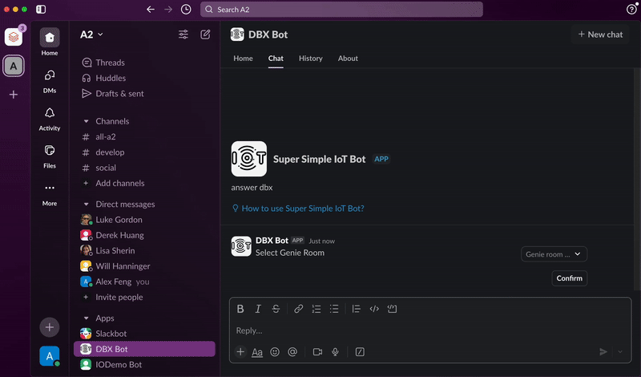

## Introduction

This repository extends the capabilities of the [Databricks Slack Bot](https://github.com/alex-lopes-databricks/databricks_apps_collection/tree/main/slack-bot) by [Alex Lopes](https://github.com/alex-lopes-databricks), allowing users to deploy a Slack app on Databricks Apps. The primary enhancement is the integration with Databricks Genie through Slack, leveraging Databricks Asset Bundles for deployment.

Once deployed, users will be able to choose a Genie room which the Databricks App's service principal has been given access to and ask for insights in natural language directly from slack.

## Credits

- **Original Repository:** [Databricks Slack Bot](https://github.com/alex-lopes-databricks/databricks_apps_collection/tree/main/slack-bot) by [Alex Lopes](https://github.com/alex-lopes-databricks).
- **Enhancements:** This repository builds upon the original by incorporating Databricks Asset Bundles to facilitate interaction with Databricks Genie via Slack.

## Features

- **Databricks Genie Integration:** Users can now interact with multiple Databricks Genie directly from Slack, enhancing collaboration and workflow efficiency.
- **Databricks Asset Bundles:** Utilizes Databricks Asset Bundles (DABs) for streamlined deployment of the Slack app on Databricks Apps.
- **Slack App Deployment:** Simplifies the process of deploying a Slack app within the Databricks environment.
- **Secret Scope Setup:** Sets up a secret scope to store Slack app and bot tokens

## Setup Instructions

### Prerequisites

1. **Databricks CLI:** Ensure you have the Databricks CLI installed and configured for your workspace. Refer to [Databricks CLI Installation](https://docs.databricks.com/en/dev-tools/cli/install.html) for setup instructions.
2. **Slack App Creation:** Create a Slack app and obtain necessary credentials. Follow the steps in the [original repository](https://github.com/alex-lopes-databricks/databricks_apps_collection/tree/main/slack-bot) for guidance.
3. **Environment:** Set up environment variables in the terminal which you will run the DABs commands. This can be done how you wish but below walks through a method that uses a .env file that is loaded by the [Python extension in VSCode](https://code.visualstudio.com/docs/python/environments#:~:text=By%20default%2C%20the%20Python%20extension,(see%20General%20Python%20settings).).
   - In databricks.yml, replace the target host with your databricks host url
   - Create a `.env` file in the root of your repository.
   - Add the following environment variables:
     - `BUNDLE_VAR_TOKEN_APP`: Your Slack app token.
     - `BUNDLE_VAR_TOKEN_BOT`: Your Slack bot token.

    The two env variables TOKEN_APP and TOKEN_BOT is passed through DABs as secrets to be used by the app using dbutils whereas the genie space ID is passed through DABs as a environment variable in the Databricks App's startup to be picked up by the app code.

4. **UC Permission Setup:** Grant the app service principal access to tables set up with your genie room as well as the room itself and the warehouse to run the room on.

### Disclaimers
**Experimental DABS Features:** To automate the population of secrets within the secret scope from local environment variables, this DABS project uses [experimental post-deployment script](https://github.com/databricks/cli/pull/632) which may change at any time.

**Ephemeral Context:** As this app has been created as a POC, the context and history of chats users have with the slack bot is tied to the memory of the app. This means if the app restarts, only new threads created after restart will work. To productionise the app, have an OLTP ddatabase to store the context for the app.
